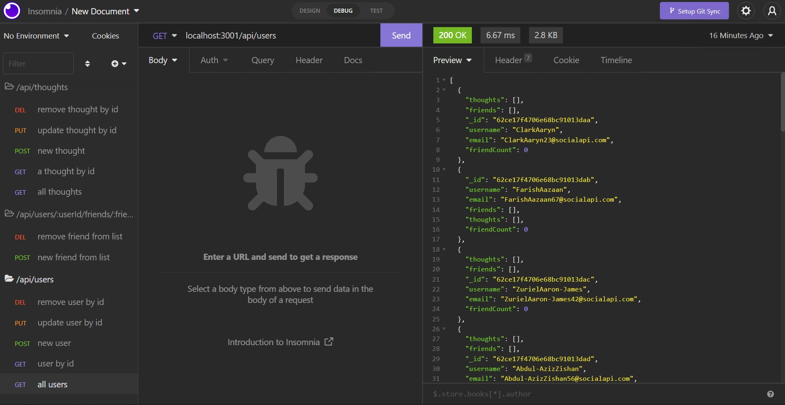

# socialAPI
## NoSQL: Social Networking API

This application creates an API for a social media startup that uses a NoSQL database to handle large amounts of unstructured data on a social network website.

## Mock-up

 *ADD SCREENSHOT*

## Installation

This application requires installation of npm (incl. express and nodemon), MongoDB, and Insomnia. 

A walkthrough video can be viewed here: 

Part 1: 

All elements of the project can be examined here: https://github.com/matthewestes33/socialAPI 

## Credits

Referenced documentation and tutorials:

Mongoose Schemas: https://mongoosejs.com/docs/guide.html#schemas

Additional assistance:

Thank you to my instructional staff and AskBCS Learning Assistants!

## Features

When a developer enters a command to invoke the application, the server is started and the Mongoose models are synced to the MongoDB database.

When a developer opens API GET routes in Insomnia for users and thoughts, the data for each of these routes is displayed in a formatted JSON object.

WHEN a developer tests API POST, PUT, and DELETE routes in Insomnia, users and thoughts are successfully created, updated, and deleted (respectively) in my database.

WHEN a developer tests API POST and DELETE routes in Insomnia, reactions to thoughts are created and deleted, and friends are added and removed from the user's friend list.
